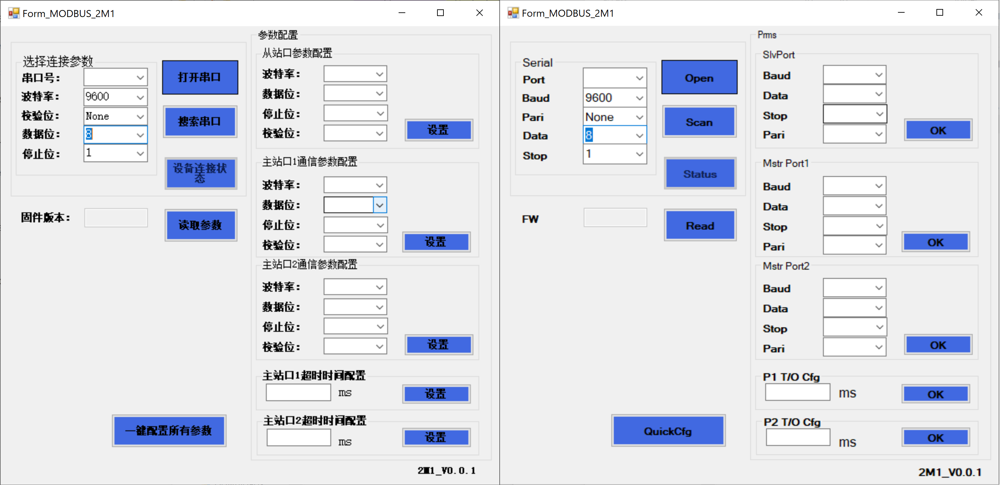

# MR0-485-2M1 Configuration Tool — English Patch

English patch for the **MR0-485-2M1** RS485 hub/repeater configuration tool (`MR0_MODBUS_2M1.exe`, also referred to as `RAEC_RS485_Tool` in the product manual).

Patches the official Chinese-only exe to display English, producing `MR0_MODBUS_2M1_EN.exe` — a drop-in replacement with the same functionality.



---

## Device: MR0-485-2M1 RS485 Hub / Repeater

**2 × RS485 Masters → 1 × RS485 Slave**

The MR0-485-2M1 is a compact DIN-rail RS485 hub that lets two independent RS485 master devices share a single slave device on the same bus. It buffers and arbitrates commands from both masters with a configurable per-port timeout, so neither master needs to know about the other.

A companion model, the **MR0-485-1T2**, does the reverse: one master to two isolated slave segments (no configuration tool required).

**Manufacturer:** Dongguan Aimoxun Automation Technology Co., Ltd.  
**Product page:** https://www.amxmotion.com/product/mr0-485-2m1/  
**Series overview:** https://www.amxmotion.com/protocol-conversion-gateway/

### Key Specifications

| Parameter | MR0-485-2M1 |
|---|---|
| Topology | 2 masters → 1 slave |
| Interfaces | 3 × RS485 (screw terminals) |
| Baud rate | 1200–256000 bps (default 9600) |
| Default format | 8N1 (configurable) |
| Max command buffer | 20 instructions |
| Master port timeout | Configurable per port (default 500 ms) |
| Transmission distance | Up to 1200 m at 9600 bps |
| Power supply | DC 24 V (reverse-polarity protected) |
| Power consumption | < 0.2 W |
| Operating temp | −10 °C to +50 °C |
| Dimensions | 82 × 54 × 32 mm |
| Mounting | DIN rail |

### Terminal Pinout

| Terminal | Description |
|---|---|
| `24V` | DC 24V positive |
| `0V` / `GND` | DC 24V negative / 485 ground |
| `A+` / `B-` | **Slave** port — RS485 A/B |
| `A0+` / `B0-` | **Master 1** port — RS485 A/B |
| `A1+` / `B1-` | **Master 2** port — RS485 A/B |

### LED Indicators

| LED | Description |
|---|---|
| `SYS` | System status — slow blink = normal; fast blink = config mode or reset |
| `SL` | Slave port TX/RX activity |
| `MA1` | Master 1 port TX/RX activity |
| `MA2` | Master 2 port TX/RX activity |

### How to Enter Configuration Mode

1. Connect a **USB-to-RS485 adapter** to the **slave port** (`A+`/`B-`) and to your PC.
2. Apply DC 24V power.
3. Within 60 seconds of power-on, press the **SET button** — `SYS` will start fast-blinking, indicating config mode is active.
4. Open the configuration tool and connect on the matching COM port at the current baud rate (default 9600, 8N1).

### Factory Reset

Hold the **SET button** for 3 seconds within 60 seconds of power-on (until `SYS` stays solid), then release. After `SYS` resumes slow blinking, power-cycle the module. All ports reset to: 9600 bps, 8 data bits, 1 stop bit, no parity, 500 ms timeout.

---

## Finding the Configuration Tool

> **If you arrived here searching for `RAEC_RS485_Tool` — you're in the right place.**

The product manual refers to the configuration software as **"RAEC_RS485_Tool"**, but the actual file distributed by the manufacturer is named **`MR0_MODBUS_2M1.exe`**. The two names refer to the same program.

The tool is not prominently linked from the main product pages, which makes it difficult to find. Known download locations:

- **Product page** (scroll to bottom for attachments/downloads): https://www.amxmotion.com/product/mr0-485-2m1/
- **Web store** (search "MR0-485"): https://www.amsamotion.com
- **Protocol gateway series page**: https://www.amxmotion.com/protocol-conversion-gateway/

The tool is Chinese-only out of the box. This repo provides a Python script to patch it to English.

---

## Configuration Tool Patch

### Files

| File | Description |
|---|---|
| `MR0_MODBUS_2M1.exe` | Original tool (`RAEC_RS485_Tool`) — **not included**, download from manufacturer |
| `patch_exe.py` | This script — patches the exe in-place |
| `MR0_MODBUS_2M1_EN.exe` | Output — patched English version |
| `TRANSLATION_NOTES.md` | Full Chinese → English translation reference |
| `MR0-485.pdf` | Original product manual |

### Requirements

- Python 3.x (no third-party packages needed — uses only `pefile` if available, but the patch itself uses raw binary search)
- Windows (the patched `.exe` is a Windows .NET 4.x application)

> `pefile` is used only for initial analysis. The patch script uses direct binary search and does not require it at runtime.

### Usage

Place `patch_exe.py` in the same directory as `MR0_MODBUS_2M1.exe`, then run:

```
python patch_exe.py
```

This produces `MR0_MODBUS_2M1_EN.exe` in the same directory. The original file is not modified.

### How It Works

`MR0_MODBUS_2M1.exe` is a .NET 4.x WinForms assembly. UI strings are stored as UTF-16LE in the `#US` (User Strings) metadata heap. The script locates each Chinese string by its UTF-16LE byte sequence and overwrites it with the English translation.

**Constraint:** each string slot has a fixed byte length. Since both Chinese and ASCII characters are 2 bytes each in UTF-16LE, the English text must fit in the same number of characters as the original Chinese. Shorter translations are padded with trailing spaces; longer ones are truncated. See `TRANSLATION_NOTES.md` for the full table.

341 of 342 strings are patched. The one unpatchable string is a multi-line tooltip containing mixed ASCII/Chinese that could not be located due to an encoding edge case — it does not affect normal use of the tool.

### What Changes

| Original (Chinese) | Patched (English) | Full meaning |
|---|---|---|
| 选择连接参数 | `Serial` | Select connection parameters |
| 串口号： | `Port` | COM port number |
| 波特率： | `Baud` | Baud rate |
| 校验位： | `Pari` | Parity bits |
| 数据位： | `Data` | Data bits |
| 停止位： | `Stop` | Stop bits |
| 打开串口 | `Open` | Open COM port |
| 关闭串口 | `Shut` | Close COM port |
| 搜索串口 | `Scan` | Search/scan COM ports |
| 设备连接状态 | `Status` | Device connection status |
| 固件版本： | `FW` | Firmware version |
| 读取参数 | `Read` | Read parameters |
| 一键配置所有参数 | `QuickCfg` | One-click configure all |
| 从站口参数配置 | `SlvPort` | Slave port config |
| 主站口1通信参数配置 | `Mstr Port1` | Master port 1 comm config |
| 主站口2通信参数配置 | `Mstr Port2` | Master port 2 comm config |
| 主站口1超时时间配置 | `P1 T/O Cfg` | Master port 1 timeout config |
| 主站口2超时时间配置 | `P2 T/O Cfg` | Master port 2 timeout config |
| 设置 | `OK` | Set / apply |
| 参数配置 | `Prms` | Parameter configuration |

See `TRANSLATION_NOTES.md` for all 341 translated strings.

---

## Workflow (Quick Start)

1. Connect USB-to-RS485 adapter to the slave port (`A+`/`B-`) of the MR0-485-2M1.
2. Power the module with DC 24V.
3. Press **SET** within 60 seconds to enter config mode.
4. Open `MR0_MODBUS_2M1_EN.exe`.
5. Select the COM port, set baud rate to **9600**, parity **None**, data bits **8**, stop bits **1**.
6. Click **Open** (opens the serial port).
7. Click **Read** to read current parameters from the device.
8. Adjust **SlvPort**, **Mstr Port1**, **Mstr Port2** baud/parity as needed.
9. Click **OK** (Set) next to each section to apply, or use **QuickCfg** to write all at once.
10. Power-cycle the module for changes to take effect.

---

## License

Patch script (`patch_exe.py`) is released under the MIT License.  
The original `MR0_MODBUS_2M1.exe` is the property of Dongguan Aimoxun Automation Technology Co., Ltd. and is not redistributed here.
