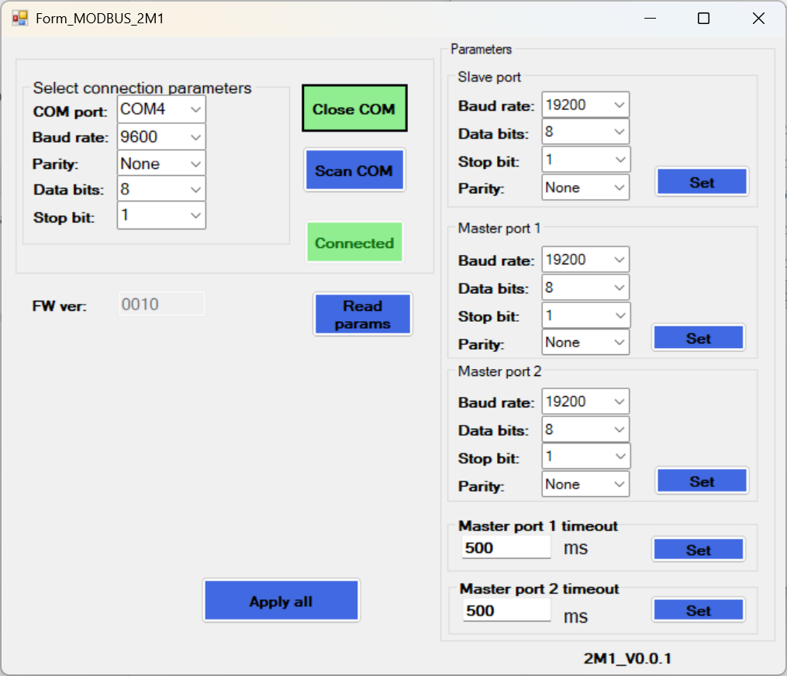

# MR0-485-2M1 Configuration Tool English Patch

English patch for the **MR0-485-2M1** RS485 hub/repeater configuration tool, also referred to as **RAEC_RS485_Tool** in the product manual.

This repo does **not** redistribute the vendor's original `MR0_MODBUS_2M1.exe`. Instead, it provides patchers that transform the original Chinese-only tool into an English version after you download it from the manufacturer/distributor link.



## If You Arrived Here Searching For `RAEC_RS485_Tool`

You are in the right place.

The manual calls the software `RAEC_RS485_Tool`, but the actual downloadable file is named `MR0_MODBUS_2M1.exe`. The two names refer to the same Windows configuration tool.

The tool is easy to miss because it is linked from the protocol gateway series page rather than the individual product page:

- Series page: [https://www.amxmotion.com/protocol-conversion-gateway/](https://www.amxmotion.com/protocol-conversion-gateway/)
- Direct download: [https://oss.amsamotion.com/uploads/MR0_MODBUS_2M1.rar](https://oss.amsamotion.com/uploads/MR0_MODBUS_2M1.rar)

## Patch Paths

This repo supports three trust/comfort levels:

| Path | Audience | Requires | Notes |
|---|---|---|---|
| Prebuilt patcher EXE | Easiest path | Nothing beyond Windows | Recommended for most users. Intended for GitHub Releases. |
| `TranslatorTools` source | Auditable advanced patcher | .NET 8 SDK | Recommended source path. Patches both text and UI layout/font settings. |
| `patch_exe.py` | Maximum simplicity / legacy fallback | Python 3 | String-only patch. Does not fix layout/font issues. |

## What The Advanced Patcher Fixes

The improved `TranslatorTools` patcher edits both:

- `.NET` string literals
- `WinForms` layout and font settings

That means it can do more than the original byte-replacement script:

- expand cramped group boxes
- move controls to make English text fit
- switch Chinese UI fonts to a normal Windows UI font
- keep a cleaner final result in the patched executable

## Quick Start

1. Download `MR0_MODBUS_2M1.rar` from the vendor link above.
2. Extract `MR0_MODBUS_2M1.exe`.
3. Choose one patch path below.

### Recommended: Prebuilt Patcher EXE

When a release asset is available, place the patcher EXE in the same folder as `MR0_MODBUS_2M1.exe` and run it.

Expected output:

```text
MR0_MODBUS_2M1_EN.exe
```

### Auditable Advanced Path: `TranslatorTools`

`TranslatorTools` is the recommended source-based patcher.

Build and publish a standalone EXE with:

```powershell
powershell -ExecutionPolicy Bypass -File .\scripts\publish-patcher.ps1
```

Or run it directly from source:

```powershell
& 'C:\Program Files\dotnet\dotnet.exe' run --project .\TranslatorTools\TranslatorTools.csproj -- patch .\MR0_MODBUS_2M1.exe .\TranslatorTools\translations.json .\MR0_MODBUS_2M1_EN.exe
```

### Legacy Minimal Path: `patch_exe.py`

Place `patch_exe.py` next to `MR0_MODBUS_2M1.exe` and run:

```powershell
python .\patch_exe.py
```

This produces:

```text
MR0_MODBUS_2M1_EN.exe
```

Use this path if you want the simplest readable patcher, but note that it only patches string bytes and will not fix button sizes, group box widths, or fonts.

## Repo Layout

| Path | Purpose |
|---|---|
| `patch_exe.py` | Legacy minimal Python patcher |
| `TranslatorTools/` | Advanced Mono.Cecil-based patcher source |
| `scripts/publish-patcher.ps1` | Builds a standalone patcher EXE |
| `TRANSLATION_NOTES.md` | Translation reference |
| `MR0-485.pdf` | Original manual |

## Screenshot

The advanced patcher now produces a much cleaner English UI than the legacy script because it adjusts both strings and layout. The proof image in the GitHub repo should be refreshed with the latest screenshot captured from the improved patcher output.

## Device Notes

The MR0-485-2M1 is a compact DIN-rail RS485 hub that lets two independent RS485 master devices share one slave device on the same bus.

- Topology: 2 masters to 1 slave
- Interfaces: 3 x RS485
- Default serial settings: 9600, 8N1
- Default master timeout: 500 ms

To enter configuration mode:

1. Connect a USB-to-RS485 adapter to the slave port.
2. Apply 24V DC power.
3. Press **SET** within 60 seconds of power-on.
4. Open the tool and connect using the current serial settings.

## Legal / Distribution Posture

This repo intentionally distributes patchers rather than the vendor EXE itself.

- Original vendor executable: not included
- Patchers and supporting source: included
- Patched output EXE: generated locally by the user

## License

The patchers and supporting source in this repo are released under the MIT License.

The original `MR0_MODBUS_2M1.exe` remains the property of its original vendor and is not redistributed here.
